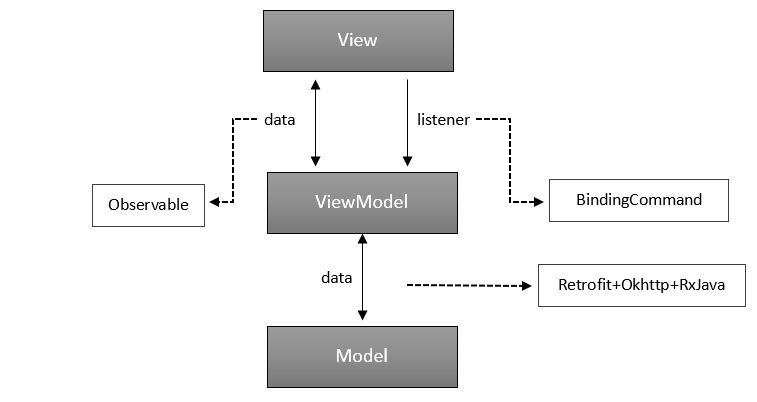
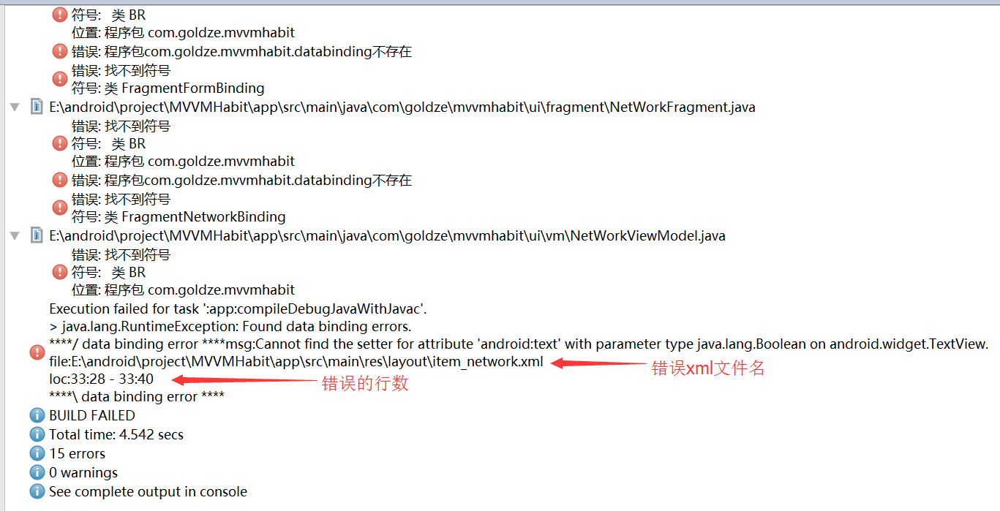
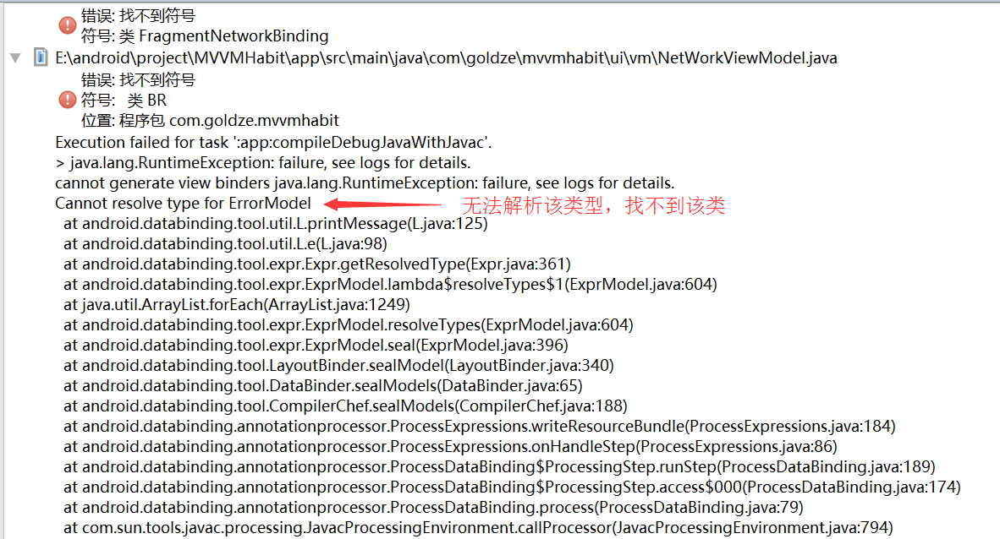

## 更新日志
**v2.0.0：2018年4月10日**

- 全面升级RxJava2；
- 优化绑定回调方式；
- 升级第三方依赖库；
- 微调例子程序。

**注：v1.x已停止维护**
# MVVMHabit
##
目前，android流行的MVC、MVP模式的开发框架很多，然而一款基于MVVM模式开发框架却很少。**MVVMHabit则是一款以谷歌的databinding为基础，整合Okhttp+RxJava+Retrofit+Glide等流行库，加上各种原生控件自定义的BindingAdapter，让事件与数据源完美绑定的一款容易上瘾的实用性快速开发框架**。从此告别findViewById()，告别setText()，告别setOnClickListener()...

## 框架流程
 

## 框架特点
- **快速开发**

	只需要写项目的业务逻辑，不用再去关心网络请求、权限申请、view的生命周期等问题，撸起袖子就是干。

- **维护方便**

	MVVM开发模式，低耦合，逻辑分明。model层负责将请求的数据交给ViewModel；ViewModel层负责将请求到的数据做业务逻辑处理，最后交给View层去展示，与View一一对应；View层只负责界面绘制刷新，不处理业务逻辑，非常适合分配独立模块开发。

- **流行框架**

	[retrofit](https://github.com/square/retrofit)+[okhttp](https://github.com/square/okhttp)+[rxJava](https://github.com/ReactiveX/RxJava)负责网络请求；[gson](https://github.com/google/gson)负责解析json数据；[glide](https://github.com/bumptech/glide)负责加载图片；[rxlifecycle](https://github.com/trello/RxLifecycle)负责管理view的生命周期；与网络请求共存亡；[rxbinding](https://github.com/JakeWharton/RxBinding)结合databinding扩展UI事件；[rxpermissions](https://github.com/tbruyelle/RxPermissions)负责Android 6.0权限申请；[material-dialogs](https://github.com/afollestad/material-dialogs)一个漂亮的、流畅的、可定制的material design风格的对话框。

- **数据绑定**

	满足google目前控件支持的databinding双向绑定，并扩展原控件一些不支持的数据绑定。例如将图片的url路径绑定到ImageView控件中，在BindingAdapter方法里面则使用Glide加载图片；View的OnClick事件在BindingAdapter中方法使用RxView防重复点击，再把事件回调到ViewModel层，实现xml与ViewModel之间数据和事件的绑定(框架里面部分扩展控件和回调命令使用的是@kelin原创的)。

- **基类封装**

	专门针对MVVM模式打造的BaseActivity、BaseFragment、BaseViewModel，在View层中不再需要定义ViewDataBinding和ViewModel，直接在BaseActivity、BaseFragment上限定泛型即可使用。普通界面只需要编写Fragment，然后使用ContainerActivity盛装(代理)，这样就不需要每个界面都在AndroidManifest中注册一遍。

- **全局操作**
	1. 全局的Activity堆栈式管理，在程序任何地方可以打开、结束指定的Activity，一键退出应用程序。
	2. LoggingInterceptor全局拦截网络请求，打印Request和Response，格式化json、xml数据显示，方便与后台调试接口。
	3. 全局Cookie，支持SharedPreferences和内存两种管理模式。
	4. 通用的网络请求异常监听，根据不同的状态码或异常设置相应的message。
	5. 全局的异常捕获，程序发生异常时不会崩溃，可跳入异常界面重启应用。
	6. 全局事件回调，提供RxBus、Messenger两种回调方式。
	7. 全局任意位置一行代码实现文件下载。


## 1、准备工作
> 网上的很多有关MVVM的资料，在此就不再阐述什么是MVVM了，不清楚的朋友可以先去了解一下。
### 1.1、启用databinding
在主工程app的build.gradle的android {}中加入：
```gradle
dataBinding {
	enabled true
}
```
### 1.2、依赖Library
从远程依赖：

在根目录的build.gradle中加入
```gradle
allprojects {
	repositories {
		...
		maven { url 'https://jitpack.io' }
	}
}
```
在主项目app的build.gradle中依赖
```gradle
dependencies {
	...
	api 'com.github.goldze:MVVMHabit:2.0.2'
}
```
或

下载例子程序，在主项目app的build.gradle中依赖例子程序中的**mvvmhabit**：
```gradle
dependencies {	
	...
	api project(':mvvmhabit')
}
```
> 旧版本 api 'com.github.goldze:MVVMHabit:1.2.6.1'
### 1.3、配置config.gradle
如果不是远程依赖，而是下载的例子程序，那么还需要将例子程序中的config.gradle放入你的主项目根目录中，然后在根目录build.gradle的第一行加入：

```gradle
apply from: "config.gradle"
```

**注意：** config.gradle中的 

android = [] 是你的开发相关版本配置，可自行修改

support = [] 是你的support相关配置，可自行修改

dependencies = [] 是依赖第三方库的配置，可以加新库，但不要去修改原有第三方库的版本号，不然可能会编译不过
### 1.4、配置AndroidManifest
添加权限：
```xml
<uses-permission android:name="android.permission.INTERNET" />
<uses-permission android:name="android.permission.ACCESS_WIFI_STATE" />
<uses-permission android:name="android.permission.READ_PHONE_STATE" />
<uses-permission android:name="android.permission.ACCESS_NETWORK_STATE" />
<uses-permission android:name="android.permission.READ_EXTERNAL_STORAGE" />
<uses-permission android:name="android.permission.WRITE_EXTERNAL_STORAGE" />
```
配置Application：

继承**mvvmhabit**中的BaseApplication，在你的自己AppApplication中配置

```java
//是否开启日志打印
KLog.init(true);
//配置全局异常崩溃操作
CaocConfig.Builder.create()
	.backgroundMode(CaocConfig.BACKGROUND_MODE_SILENT) //背景模式,开启沉浸式
	.enabled(true) //是否启动全局异常捕获
	.showErrorDetails(true) //是否显示错误详细信息
	.showRestartButton(true) //是否显示重启按钮
	.trackActivities(true) //是否跟踪Activity
	.minTimeBetweenCrashesMs(2000) //崩溃的间隔时间(毫秒)
	.errorDrawable(R.mipmap.ic_launcher) //错误图标
	.restartActivity(LoginActivity.class) //重新启动后的activity
	//.errorActivity(YourCustomErrorActivity.class) //崩溃后的错误activity
	//.eventListener(new YourCustomEventListener()) //崩溃后的错误监听
	.apply();
```

## 2、快速上手

### 2.1、第一个Activity
> 以大家都熟悉的登录操作为例：三个文件**LoginActivty.java**、**LoginViewModel.java**、**activity_login.xml**

##### 2.1.1、关联ViewModel
在activity_login.xml中关联LoginViewModel。
```xml
<layout>

	<data>
        <variable
			type="com.goldze.mvvmhabit.ui.vm.LoginViewModel"
			name="viewModel"
            />
    </data>

		.....

</layout>
```

> variable - type：类的全路径 <br>variable - name：变量名

##### 2.1.2、继承Base

LoginActivity继承BaseActivity
```java
public class LoginActivity extends BaseActivity<ActivityLoginBinding, LoginViewModel> {
	....
}
```
> 保存activity_login.xml后databing会生成一个ActivityLoginBinding类。

BaseActivity是一个抽象类，有两个泛型参数，一个是ViewDataBinding，另一个是BaseViewModel，上面的ActivityLoginBinding则是继承的ViewDataBinding作为第一个泛型参数，LoginViewModel继承BaseViewModel作为第二个泛型参数。

重写BaseActivity的三个抽象方法
```java
@Override
public int initContentView() {
	return R.layout.activity_login;
}

@Override
public int initVariableId() {
	return BR.viewModel;
}

@Override
public LoginViewModel initViewModel() {
	//View持有ViewModel的引用 (考虑到框架适用性，这里暂时没有用Dagger2解耦)
	return new LoginViewModel(this);
}
```
initContentView() 返回界面layout的id<br>
initVariableId() 返回变量的id，对应activity_login中variable - name：变量名，就像一个控件的id，可以使用R.id.xxx，这里的BR跟R文件一样，由系统生成，使用BR.xxx找到这个ViewModel的id。<br>
initViewModel() 返回ViewModel对象

LoginViewModel继承BaseViewModel
```java
public LoginViewModel(Context context) {
	super(context);
}
```
在构造方法中调用super(context) 将上下文交给父类，即可使用父类的showDialog()、startActivity()等方法。在这个LoginViewModel中就可以尽情的写你的逻辑了！
> BaseFragment的使用和BaseActivity一样，详情参考Demo。

### 2.2、数据绑定
> 拥有databinding框架自带的双向绑定，也有扩展
##### 2.2.1、传统绑定
绑定用户名：

在LoginViewModel中定义
```java
//用户名的绑定
public ObservableField<String> userName = new ObservableField<>("");
```
在用户名EditText标签中绑定
```xml
android:text="@={viewModel.userName}"
```
这样一来，输入框中输入了什么，userName.get()的内容就是什么，userName.set("")设置什么，输入框中就显示什么。
**注意：** @符号后面需要加=号才能达到双向绑定效果；userName需要是public的，不然viewModel无法找到它。

点击事件绑定：

在LoginViewModel中定义
```java
//登录按钮的点击事件
public View.OnClickListener loginOnClick = new View.OnClickListener() {
	@Override
	public void onClick(View v) {
            
	}
};
```
在登录按钮标签中绑定
```xml
android:onClick="@{viewModel.loginOnClick}"
```
这样一来，用户的点击事件直接被回调到ViewModel层了，更好的维护了业务逻辑

这就是强大的databing框架双向绑定的特性，不用再给控件定义id，setText()，setOnClickListener()。

**但是，光有这些，完全满足不了我们复杂业务的需求啊！MVVMHabit闪亮登场：它有一套自定义的绑定规则，可以满足大部分的场景需求，请继续往下看。**

##### 2.2.2、自定义绑定
还拿点击事件说吧，不用传统的绑定方式，使用自定义的点击事件绑定。

在LoginViewModel中定义
```java
//登录按钮的点击事件
public BindingCommand loginOnClickCommand = new BindingCommand(new BindingAction() {
	@Override
	public void call() {
            
	}
});
```
在activity_login中定义命名空间
```xml
xmlns:binding="http://schemas.android.com/apk/res-auto"
```
在登录按钮标签中绑定
```xml
binding:onClickCommand="@{viewModel.loginOnClickCommand}"
```
这和原本传统的绑定不是一样吗？不，这其实是有差别的。使用这种形式的绑定，在原本事件绑定的基础之上，带有防重复点击的功能，1秒内多次点击也只会执行一次操作。如果不需要防重复点击，可以加入这条属性
```xml
binding:isThrottleFirst="@{Boolean.TRUE}"
```
那这功能是在哪里做的呢？答案在下面的代码中。
```java
//防重复点击间隔(秒)
public static final int CLICK_INTERVAL = 1;

/**
* requireAll 是意思是是否需要绑定全部参数, false为否
* View的onClick事件绑定
* onClickCommand 绑定的命令,
* isThrottleFirst 是否开启防止过快点击
*/
@BindingAdapter(value = {"onClickCommand", "isThrottleFirst"}, requireAll = false)
public static void onClickCommand(View view, final BindingCommand clickCommand, final boolean isThrottleFirst) {
	if (isThrottleFirst) {
		RxView.clicks(view)
		.subscribe(new Consumer<Object>() {
			@Override
			public void accept(Object object) throws Exception {
				if (clickCommand != null) {
					clickCommand.execute();
				}
			}
		});
	} else {
		RxView.clicks(view)
		.throttleFirst(CLICK_INTERVAL, TimeUnit.SECONDS)//1秒钟内只允许点击1次
		.subscribe(new Consumer<Object>() {
			@Override
			public void accept(Object object) throws Exception {
				if (clickCommand != null) {
 					clickCommand.execute();
				}
			}
		});
	}
}
```
onClickCommand方法是自定义的，使用@BindingAdapter注解来标明这是一个绑定方法。在方法中使用了RxView来增强view的clicks事件，.throttleFirst()限制订阅者在指定的时间内重复执行，最后通过BindingCommand将事件回调出去，就好比有一种拦截器，在点击时先做一下判断，然后再把事件沿着他原有的方向传递。

是不是觉得有点意思，好戏还在后头呢！
##### 2.2.3、自定义ImageView图片加载
绑定图片路径：

在ViewModel中定义
```java
public String imgUrl = "http://img0.imgtn.bdimg.com/it/u=2183314203,562241301&fm=26&gp=0.jpg";
```
在ImageView标签中
```xml
binding:url="@{viewModel.imgUrl}"
```
url是图片路径，这样绑定后，这个ImageView就会去显示这张图片，不限网络图片还是本地图片。

如果需要给一个默认加载中的图片，可以加这一句
```xml
binding:placeholderRes="@{R.mipmap.ic_launcher_round}"
```
> R文件需要在data标签中导入使用，如：`<import type="com.goldze.mvvmhabit.R" />`

BindingAdapter中的实现
```java
@BindingAdapter(value = {"url", "placeholderRes"}, requireAll = false)
public static void setImageUri(ImageView imageView, String url, int placeholderRes) {
	if (!TextUtils.isEmpty(url)) {
		//使用Glide框架加载图片
		Glide.with(imageView.getContext())
			.load(url)
			.placeholder(placeholderRes)
			.into(imageView);
	}
}
```
很简单就自定义了一个ImageView图片加载的绑定，学会这种方式，可自定义扩展。
> 如果你对这些感兴趣，可以下载源码，在binding包中可以看到各类控件的绑定实现方式

##### 2.2.4、RecyclerView绑定
> RecyclerView也是很常用的一种控件，传统的方式需要针对各种业务要写各种Adapter，如果你使用了mvvmhabit，则可大大简化这种工作量，从此告别setAdapter()。

在ViewModel中定义：
```java
//给RecyclerView添加items
public final ObservableList<NetWorkItemViewModel> observableList = new ObservableArrayList<>();
//给RecyclerView添加ItemBinding
public final ItemBinding<NetWorkItemViewModel> itemBinding = ItemBinding.of(BR.viewModel, R.layout.item_network);
```
ObservableList<>和ItemBinding<>的泛型是Item布局所对应的ItemViewModel

在xml中绑定
```xml
<android.support.v7.widget.RecyclerView
	android:layout_width="match_parent"
	android:layout_height="match_parent"
	binding:itemBinding="@{viewModel.itemBinding}"
	binding:items="@{viewModel.observableList}"
	binding:layoutManager="@{LayoutManagers.linear()}"
	binding:lineManager="@{LineManagers.horizontal()}" />
```
layoutManager控制是线性(包含水平和垂直)排列还是网格排列，lineManager是设置分割线

网格布局的写法：`binding:layoutManager="@{LayoutManagers.grid(3)}`</br>
水平布局的写法：`binding:layoutManager="@{LayoutManagers.linear(LinearLayoutManager.HORIZONTAL,Boolean.FALSE)}"`</br>

使用到相关类，则需要导入该类才能使用，和导入Java类相似

> `<import type="me.tatarka.bindingcollectionadapter2.LayoutManagers" />`</br>
> `<import type="me.goldze.mvvmhabit.binding.viewadapter.recyclerview.LineManagers" />`</br>
> `<import type="android.support.v7.widget.LinearLayoutManager" />`


这样绑定后，在ViewModel中调用ObservableList的add()方法，添加一个Item的ViewModel，界面上就会实时绘制出一个Item。在Item对应的ViewModel中，同样可以以绑定的形式完成逻辑
> 可以在请求到数据后，循环添加`observableList.add(new NetWorkItemViewModel(context, entity));`详细可以参考例子程序中NetWorkViewModel类

更多RecyclerView、ListView、ViewPager等绑定方式，请参考 [https://github.com/evant/binding-collection-adapter](https://github.com/evant/binding-collection-adapter)

### 2.3、网络请求
> 网络请求一直都是一个项目的核心，现在的项目基本都离不开网络，一个好用网络请求框架可以让开发事半功倍。
#### 2.3.1、Retrofit+Okhttp+RxJava
> 现今，这三个组合基本是网络请求的标配，如果你对这三个框架不了解，建议先去查阅相关资料。

square出品的框架，用起来确实非常方便。**MVVMHabit**中引入了
```gradle
api "com.squareup.okhttp3:okhttp:3.10.0"
api "com.squareup.retrofit2:retrofit:2.4.0"
api "com.squareup.retrofit2:converter-gson:2.4.0"
api "com.squareup.retrofit2:adapter-rxjava2:2.4.0"
```
构建Retrofit时加入
```java
Retrofit retrofit = new Retrofit.Builder()
	.addConverterFactory(GsonConverterFactory.create())
	.addCallAdapterFactory(RxJavaCallAdapterFactory.create())
	.build();
```
或者直接使用例子程序中封装好的RetrofitClient
#### 2.3.2、网络拦截器
**LoggingInterceptor：** 全局拦截请求信息，格式化打印Request、Response，可以清晰的看到与后台接口对接的数据，
```java
LoggingInterceptor mLoggingInterceptor = new LoggingInterceptor
	.Builder()//构建者模式
	.loggable(true) //是否开启日志打印
	.setLevel(Level.BODY) //打印的等级
	.log(Platform.INFO) // 打印类型
	.request("Request") // request的Tag
	.response("Response")// Response的Tag
	.addHeader("version", BuildConfig.VERSION_NAME)//打印版本
	.build()
```
构建okhttp时加入
```java
OkHttpClient okHttpClient = new OkHttpClient.Builder()
	.addInterceptor(mLoggingInterceptor)
	.build();
```
**CacheInterceptor：** 缓存拦截器，当没有网络连接的时候自动读取缓存中的数据，缓存存放时间默认为3天。</br>
创建缓存对象
```java
//缓存时间
int CACHE_TIMEOUT = 10 * 1024 * 1024
//缓存存放的文件
File httpCacheDirectory = new File(mContext.getCacheDir(), "goldze_cache");
//缓存对象
Cache cache = new Cache(httpCacheDirectory, CACHE_TIMEOUT);
```
构建okhttp时加入
```java
OkHttpClient okHttpClient = new OkHttpClient.Builder()
	.cache(cache)
 	.addInterceptor(new CacheInterceptor(mContext))
	.build();
```
#### 2.3.3、Cookie管理
**MVVMHabit**提供两种CookieStore：**PersistentCookieStore** (SharedPreferences管理)和**MemoryCookieStore** (内存管理)，可以根据自己的业务需求，在构建okhttp时加入相应的cookieJar
```java
OkHttpClient okHttpClient = new OkHttpClient.Builder()
	.cookieJar(new CookieJarImpl(new PersistentCookieStore(mContext)))
	.build();
```
或者
```java
OkHttpClient okHttpClient = new OkHttpClient.Builder()
	.cookieJar(new CookieJarImpl(new MemoryCookieStore()))
	.build();
```
#### 2.3.4、绑定生命周期
请求在ViewModel层，且持有View的引用，所以可以直接在ViewModel中绑定请求的生命周期，View与请求共存亡。
```java
RetrofitClient.getInstance().create(DemoApiService.class)
	.demoGet()
	.compose(RxUtils.bindToLifecycle(context)) // 请求与View周期同步
	.compose(RxUtils.schedulersTransformer())  // 线程调度
	.compose(RxUtils.exceptionTransformer())   // 网络错误的异常转换
	.subscribe(new Consumer<BaseResponse<DemoEntity>>() {
		@Override
		public void accept(BaseResponse<DemoEntity> response) throws Exception {
                       
		}
	}, new Consumer<ResponseThrowable>() {
		@Override
		public void accept(ResponseThrowable throwable) throws Exception {
                        
		}
	});

```
在请求时关键需要加入组合操作符`.compose(RxUtils.bindToLifecycle(context))`<br>
**注意：** 如果你没有使用 **mvvmabit** 里面的BaseActivity或BaseFragment，使用自己定义Base，那么需要让你自己的Activity继承RxAppCompatActivity、Fragment继承RxFragment才能用`RxUtils.bindToLifecycle(context)`方法。
#### 2.3.5、网络异常处理
网络异常在网络请求中非常常见，比如请求超时、解析错误、资源不存在、服务器内部错误等，在客户端则需要做相应的处理(当然，你可以把一部分异常甩锅给网络，比如当出现code 500时，提示：请求超时，请检查网络连接，此时偷偷将异常信息发送至后台(手动滑稽))。<br>

在使用Retrofit请求时，加入组合操作符`.compose(RxUtils.exceptionTransformer())`，当发生网络异常时，回调onError(ResponseThrowable)方法，可以拿到异常的code和message，做相应处理。<br>

> mvvmhabit中自定义了一个[ExceptionHandle](./mvvmhabit/src/main/java/me/goldze/mvvmhabit/http/ExceptionHandle.java)，已为你完成了大部分网络异常的判断，也可自行根据项目的具体需求调整逻辑。<br>

**注意：** 这里的网络异常code，并非是与服务端协议约定的code。网络异常可以分为两部分，一部分是协议异常，即出现code = 404、500等，属于HttpException，另一部分为请求异常，即出现：连接超时、解析错误、证书验证失等。而与服务端约定的code规则，它不属于网络异常，它是属于一种业务异常。在请求中可以使用RxJava的filter(过滤器)，也可以自定义BaseSubscriber统一处理网络请求的业务逻辑异常。由于每个公司的业务协议不一样，所以具体需要你自己来处理该类异常。
## 3、辅助功能
> 一个完整的快速开发框架，当然也少不了常用的辅助类。下面来介绍一下**MVVMabit**中有哪些辅助功能。
### 3.1、事件总线
> 事件总线存在的优点想必大家都很清楚了，android自带的广播机制对于组件间的通信而言，使用非常繁琐，通信组件彼此之间的订阅和发布的耦合也比较严重，特别是对于事件的定义，广播机制局限于序列化的类（通过Intent传递），不够灵活。
#### 3.3.1、RxBus
RxBus并不是一个库，而是一种模式。相信大多数开发者都使用过EventBus，对RxBus也是很熟悉。由于**MVVMabit**中已经加入RxJava，所以采用了RxBus代替EventBus作为事件总线通信，以减少库的依赖。

使用方法：

在ViewModel中重写registerRxBus()方法来注册RxBus，重写removeRxBus()方法来移除RxBus
```java
//订阅者
private Disposable mSubscription;
//注册RxBus
@Override
public void registerRxBus() {
	super.registerRxBus();
	mSubscription = RxBus.getDefault().toObservable(String.class)
		.subscribe(new Consumer<String>() {
			@Override
 			public void accept(String s) throws Exception {

			}
		});
	//将订阅者加入管理站
	RxSubscriptions.add(mSubscription);
}

//移除RxBus
@Override
public void removeRxBus() {
	super.removeRxBus();
	//将订阅者从管理站中移除
	RxSubscriptions.remove(mSubscription);
}
```
在需要执行回调的地方发送
```java
RxBus.getDefault().post(object);
```
#### 3.3.2、Messenger
Messenger是一个轻量级全局的消息通信工具，在我们的复杂业务中，难免会出现一些交叉的业务，比如ViewModel与ViewModel之间需要有数据交换，这时候可以轻松地使用Messenger发送一个实体或一个空消息，将事件从一个ViewModel回调到另一个ViewModel中。

使用方法：

定义一个静态String类型的字符串token
```java
public static final String TOKEN_LOGINVIEWMODEL_REFRESH = "token_loginviewmodel_refresh";
```
在ViewModel中注册消息监听
```java
//注册一个空消息监听 
//参数1：接受人（上下文）
//参数2：定义的token
//参数3：执行的回调监听
Messenger.getDefault().register(context, LoginViewModel.TOKEN_LOGINVIEWMODEL_REFRESH, new BindingAction() {
	@Override
	public void call() {
	
	}
});

//注册一个带数据回调的消息监听 
//参数1：接受人（上下文）
//参数2：定义的token
//参数3：实体的泛型约束
//参数4：执行的回调监听
Messenger.getDefault().register(context, LoginViewModel.TOKEN_LOGINVIEWMODEL_REFRESH, String.class, new Consumer<String>() {
	@Override
 public void accept(String s) throws Exception {
                
	}
});
```
在需要回调的地方使用token发送消息
```java
//发送一个空消息
//参数1：定义的token
Messenger.getDefault().sendNoMsg(LoginViewModel.TOKEN_LOGINVIEWMODEL_REFRESH);

//发送一个带数据回调消息
//参数1：回调的实体
//参数2：定义的token
Messenger.getDefault().send("refresh",LoginViewModel.TOKEN_LOGINVIEWMODEL_REFRESH);
```
> token最好不要重名，不然可能就会出现逻辑上的bug，为了更好的维护和清晰逻辑，建议以`aa_bb_cc`的格式来定义token。aa：TOKEN，bb：ViewModel的类名，cc：动作名（功能名）。

> 为了避免大量使用Messenger，建议只在ViewModel与ViewModel之间使用，View与ViewModel之间采用ObservableField去监听UI上的逻辑，可在继承了Base的Activity或Fragment中重写initViewObservable()方法来初始化UI的监听


注册了监听，当然也要解除它。在BaseActivity、BaseFragment的onDestroy()方法里已经调用`Messenger.getDefault().unregister(this);`解除注册，所以不用担心忘记解除导致的逻辑错误和内存泄漏。
### 3.2、文件下载
文件下载几乎是每个app必备的功能，图文的下载，软件的升级等都要用到，mvvmhabit使用Retrofit+Okhttp+RxJava+RxBus实现一行代码监听带进度的文件下载。

下载文件
```java
String loadUrl = "你的文件下载路径";
String destFileDir = context.getCacheDir().getPath();  //文件存放的路径
String destFileName = System.currentTimeMillis() + ".apk";//文件存放的名称
DownLoadManager.getInstance().load(loadUrl, new ProgressCallBack<ResponseBody>(destFileDir, destFileName) {
	@Override
	public void onStart() {
		//RxJava的onStart()
	}

	@Override
	public void onCompleted() {
		//RxJava的onCompleted()
	}

	@Override
	public void onSuccess(ResponseBody responseBody) {
		//下载成功的回调
	}

	@Override
	public void progress(final long progress, final long total) {
		//下载中的回调 progress：当前进度 ，total：文件总大小
	}

	@Override
	public void onError(Throwable e) {
		//下载错误回调
	}
});
```
> 在ProgressResponseBody中使用了RxBus，发送下载进度信息到ProgressCallBack中，继承ProgressCallBack就可以监听到下载状态。回调方法全部执行在主线程，方便UI的更新，详情请参考例子程序。
### 3.3、ContainerActivity
一个盛装Fragment的一个容器(代理)Activity，普通界面只需要编写Fragment，使用此Activity盛装，这样就不需要每个界面都在AndroidManifest中注册一遍

使用方法：

在ViewModel中调用BaseViewModel的方法开一个Fragment
```java
startContainerActivity(你的Fragment类名.class.getCanonicalName())
```
在ViewModel中调用BaseViewModel的方法，携带一个序列化实体打开一个Fragment
```
Bundle mBundle = new Bundle();
mBundle.putParcelable("entity", entity);
startContainerActivity(你的Fragment类名.class.getCanonicalName(), mBundle);
```
在你的Fragment中取出实体
```
Bundle mBundle = getArguments();
if (mBundle != null) {
	entity = mBundle.getParcelable("entity");
}
```
### 3.4、6.0权限申请
> 对RxPermissions已经熟悉的朋友可以跳过。

使用方法：

例如请求相机权限，在ViewModel中调用
```java
//请求打开相机权限
RxPermissions rxPermissions = new RxPermissions((Activity) context);
rxPermissions.request(Manifest.permission.CAMERA)
	.subscribe(new Consumer<Boolean>() {
		@Override
		 public void accept(Boolean aBoolean) throws Exception {
			if (aBoolean) {
				ToastUtils.showShort("权限已经打开，直接跳入相机");
			} else {
				ToastUtils.showShort("权限被拒绝");
			}
		}
	});
```
更多权限申请方式请参考[RxPermissions原项目地址](https://github.com/tbruyelle/RxPermissions)
### 3.5、图片压缩
> 为了节约用户流量和加快图片上传的速度，某些场景将图片在本地压缩后再传给后台，所以特此提供一个图片压缩的辅助功能。

使用方法：

RxJava的方式压缩单张图片，得到一个压缩后的图片文件对象
```java
String filePath = "mnt/sdcard/1.png";
ImageUtils.compressWithRx(filePath, new Consumer<File>() {
	@Override
	public void accept(File file) throws Exception {
		//将文件放入RequestBody
		...
	}
});
```
RxJava的方式压缩多张图片，按集合顺序每压缩成功一张，都将在onNext方法中得到一个压缩后的图片文件对象
```java
List<String> filePaths = new ArrayList<>();
filePaths.add("mnt/sdcard/1.png");
filePaths.add("mnt/sdcard/2.png");
ImageUtils.compressWithRx(filePaths, new Subscriber() {
	@Override
	public void onCompleted() {
	
	}
	
	@Override
	public void onError(Throwable e) {
	
	}
	
	@Override
	public void onNext(File file) {

	}
});
```
### 3.6、其他辅助类
**ToastUtils：** 吐司工具类

**MaterialDialogUtils：** Material风格对话框工具类

**SPUtils：** SharedPreferences工具类

**SDCardUtils：** SD卡相关工具类

**ConvertUtils：** 转换相关工具类

**StringUtils：** 字符串相关工具类

**RegexUtils：** 正则相关工具类

**KLog：** 日志打印，含json格式打印

## 4、附加

### 4.1、编译错误解决方法
> 使用databinding其实有个缺点，就是会遇到一些编译错误，而AS不能很好的定位到错误的位置，这对于刚开始使用databinding的开发者来说是一个比较郁闷的事。那么我在此把我自己在开发中遇到的各种编译问题的解决方法分享给大家，希望这对你会有所帮助。
##### 4.1.1、绑定错误
绑定错误是一个很常见的错误，基本都会犯。比如TextView的 `android:text=""` ，本来要绑定的是一个String类型，结果你不小心，可能绑了一个Boolean上去，或者变量名写错了，这时候编辑器不会报红错，而是在点编译运行的时候，在AS的Messages中会出现错误提示，如下图：



解决方法：把错误提示拉到最下面 (上面的提示找不到BR类这个不要管它)，看最后一个错误 ，这里会提示是哪个xml出了错，并且会定位到行数，按照提示找到对应位置，即可解决该编译错误的问题。

**注意：** 行数要+1，意思是上面报出第33行错误，实际是第34行错误，AS定位的不准确 (这可能是它的一个bug)
##### 4.1.2、xml导包错误

在xml中需要导入ViewModel或者一些业务相关的类，假如在xml中导错了类，那一行则会报红，但是res/layout却没有错误提示，有一种场景，非常特殊，不容易找出错误位置。就是你写了一个xml，导入了一个类，比如XXXUtils，后来因为业务需求，把那个XXXUtils删了，这时候res/layout下不会出现任何错误，而你在编译运行的时候，才会出现错误日志。苦逼的是，不会像上面那样提示哪一个xml文件，哪一行出错了，最后一个错误只是一大片的报错报告。如下图：



解决方法：同样找到最后一个错误提示，找到Cannot resolve type for **xxx**这一句 (xxx是类名)，然后使用全局搜索 (Ctrl+H) ，搜索哪个xml引用了这个类，跟踪点击进去，在xml就会出现一个红错，即可解析该编译错误的问题。

## 混淆
例子程序中给出了最新的【MVVMHabit混淆规则】，包含MVVMHabit中依赖的所有第三方library，可以将规则直接拷贝到自己app的混淆规则中。在此基础上你只需要关注自己业务代码以及自己引入第三方的混淆，【MVVMHabit混淆规则】请参考app目录下的[proguard-rules.pro](./app/proguard-rules.pro)文件。
## About
**goldze：** 本人喜欢尝试新的技术，以后发现有好用的东西，我将会在企业项目中实战，没有问题了就会把它引入到**MVVMHabit**中，一直维护着这套框架，谢谢各位朋友的支持。如果觉得这套框架不错的话，麻烦点个 **star**，你的支持则是我前进的动力！

**QQ群**：84692105
## License

	 Copyright 2017 goldze(曾宪泽)
 
	 Licensed under the Apache License, Version 2.0 (the "License");
	 you may not use this file except in compliance with the License.
	 You may obtain a copy of the License at
 
	    http://www.apache.org/licenses/LICENSE-2.0
 
	 Unless required by applicable law or agreed to in writing, software
	 distributed under the License is distributed on an "AS IS" BASIS,
	 WITHOUT WARRANTIES OR CONDITIONS OF ANY KIND, either express or implied.
	 See the License for the specific language governing permissions and
	 limitations under the License.
