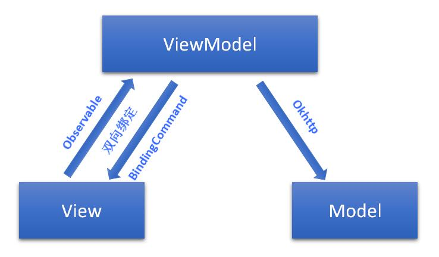

#MVVMHabit
##
目前，android流行的MVC、MVP模式的开发框架很多，然而一款基于MVVM模式开发框架却很少。**MVVMHabit**则是一款以谷歌的databinding为基础，整合Okhttp+RxJava+Retrofit+Glide等流行库，加上各种原生控件自定义的BindingAdapter，让事件与数据源完美绑定的一款容易上瘾的快速开发框架。再也不用findViewById()，再也不用setText()，再也不用setOnClickListener()...

 

##框架特点
- **快速开发**

	只需要写项目的业务逻辑，不用再去关心网络请求、权限申请、view的生命周期等问题，撸起袖子就是干。

- **维护方便**

	MVVM开发模式，低耦合，逻辑分明。model层负责将请求的数据交给ViewModel；ViewModel层负责将请求到的数据做业务逻辑处理，最后交给View层去展示，与View一一对应；View层只负责界面绘制刷新，不处理业务逻辑，非常适合分配独立模块开发。

- **流行框架**

	[retrofit](https://github.com/square/retrofit)+[okhttp](https://github.com/square/okhttp)+[rxJava](https://github.com/ReactiveX/RxJava)负责网络请求；[gson](https://github.com/google/gson)负责解析json数据；[glide](https://github.com/bumptech/glide)负责加载图片；[rxlifecycle](https://github.com/trello/RxLifecycle)负责管理view的生命周期；与网络请求共存亡；[rxbinding](https://github.com/JakeWharton/RxBinding)结合databinding扩展UI事件；[rxpermissions](https://github.com/tbruyelle/RxPermissions)负责Android 6.0权限申请；[material-dialogs](https://github.com/afollestad/material-dialogs)一个漂亮的、流畅的、可定制的material design风格的对话框。

- **数据绑定**

	满足google目前控件支持的databinding双向绑定，并扩展原控件一些不支持的数据绑定。例如将图片的url路径绑定到ImageView控件中，在BindingAdapter方法里面则使用Glide加载图片；View的OnClick事件在BindingAdapter中方法使用RxView防重复点击，再把事件回调到ViewModel层，框架里面部分扩展控件和回调命令使用的是@kelin原创的

- **基类封装**

	专门针对MVVM模式打造的BaseActivity、BaseFragment、BaseViewModel，在View层中不再需要定义ViewDataBinding和ViewModel，直接在BaseActivity、BaseFragment上限定泛型即可使用

- ****
##一、快速上手

